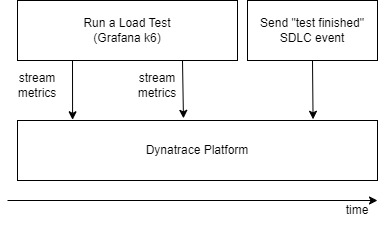

This demo will run a [Grafana k6](https://k6.io){target=_blank} script and use the [Dynatrace output plugin](https://www.dynatrace.com/hub/detail/grafana-k6){target=_blank} to stream metrics to Dynatrace.

## Logical Architecture

Below is the "flow" of information and actors during this demo.

This architecture also holds true for other load testing tools (eg. JMeter).

1. A load test is executed.
The HTTP requests are annotated with [the standard header values](https://docs.dynatrace.com/docs/platform-modules/automations/cloud-automation/test-automation#tag-tests-with-http-headers)(target=_blank).

1. Metrics are streamed during the load test (if the load testing tool supports this)
or the metrics are send at the end of the load test.

1. The load testing tool is responsible for sending an SDLC event to signal "test is finished".
Integrators are responsible for crafting this event to contain any important information required by Dynatrace
such as the test duration.

1. A [workflow](https://docs.dynatrace.com/docs/platform-modules/automations/workflows){target=_blank} is triggered on receipt of this event.
The workflow triggers the [Site Reliability Guardian](https://docs.dynatrace.com/docs/platform-modules/automations/site-reliability-guardian){target=_blank}.

1. The Site Reliability Guardian processes the load testing metrics and to provide an automated load testing report.
This can be used for information only or can be used as an automated "go / no go" decision point.

1. Dynatrace users can view the results in a dashboard, notebook or use the result as a trigger for further automated workflows.

1. Integrators have the choice to send (emit) the results to an external tool.
This external tool can then use this result.
One example would be sending the SRG result to Jenkins to progress or prevent a deployment.

## Compatibility

| Deployment         | Tutorial Compatible |
|--------------------|---------------------|
| Dynatrace Managed  | ✔️                 |
| Dynatrace SaaS     | ✔️                 |

- [Click Here to Begin :octicons-arrow-right-24:](getting-started.md)

