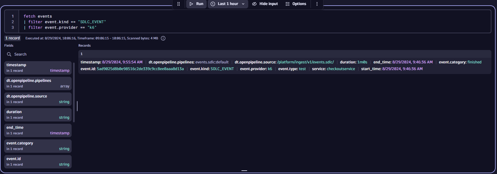

## Run Demo

--8<-- "snippets/live-code-snippets-button-executor.md"

## Import Dynatrace Dashboard

While you are waiting for the environment, add the dashboard to your Dynatrace environment.

1. Save the [k6 dashboard](https://github.com/dynatrace-perfclinics/obslab-k6/blob/main/dashboards/Grafana%20k6%20Dashboard.json){target=_blank} to your local machine.
1. In Dynatrace, navigate to `Dashboards` and click `Upload`
1. Upload the dashboard JSON file

## Start k6

In the codespace terminal, type `docker ps` and wait until Docker is running.

You should see this:

```
CONTAINER ID   IMAGE     COMMAND   CREATED   STATUS    PORTS     NAMES
```

``` {"name": "docker ps"}
docker ps
```

<button class="executor" onclick="sendRequest(this, 'docker ps')">&#9658;</button>

Now run k6 with the demo script. This script takes 1 minute to execute so be patient:

``` {"name": "docker run k6"}
docker run \
    -e K6_DYNATRACE_URL=$DT_URL \
    -e K6_DYNATRACE_APITOKEN=$DT_K6_TOKEN \
    --mount type=bind,source=/workspaces/$RepositoryName/k6scripts,target=/k6scripts hrexed/xk6-dynatrace-output:0.11 run /k6scripts/script.js \
    -o output-dynatrace
```

<button class="executor" onclick="sendRequest(this, 'docker run k6')">&#9658;</button>

## Validate Metrics

k6 streams metrics into Dynatrace so after about a minute, do the following to ensure metrics are reaching Dynatrace.

In Dynatrace:

* Press `ctrl + k` and search for `notebooks`
* Create a new notebook and add a new `DQL` section
* Type the following: `timeseries avg(k6)`
* Press `ctrl + =` to bring up auto completion. You should see the list of ingest


## View Events

When the load test finished, the [teardown function](https://github.com/Dynatrace/obslab-k6/blob/d2e11127f3a9e7665d67ab2015c7e4a2d7599b96/k6scripts/script.js#L17){target=_blank} sends a Software Delivery Lifecycle Event (SDLC) to Dynatrace.

```
// Run load with 2 virtual users for 1 minute
export const options = {
  vus: 2,
  duration: '1m',
};

...

export function teardown() {
  let post_params = {
    headers: {
      'Content-Type': 'application/json',
      'Authorization': `Api-Token ${__ENV.K6_DYNATRACE_APITOKEN}`
    },
  };

  // Send SDLC event at the end of the test
  let payload = {
    "event.provider": "k6",
    "event.type": "test",
    "event.category": "finished",
    "service": "dummyservice",
    "duration": options.duration
  }
  let res = http.post(`${__ENV.K6_DYNATRACE_URL}/platform/ingest/v1/events.sdlc`, JSON.stringify(payload), post_params);
}
```

Notice that the event contains metadata such as the `provider` and `service` which can be used for filtering in Dynatrace (see DQL below).

This event can be used as a trigger Dynatrace for workflows, synthetic tests, the site reliability guardian and more.

In Dynatrace:

* Press `ctrl + k` and search for `notebooks`
* Open an existing notebook or create a new one
* Add a new `DQL` section and paste the following

```
fetch events
| filter event.kind == "SDLC_EVENT"
| filter event.provider == "k6"
```



User exercise: Modify the JSON body to also send the number of Virtual Users (VUs) used to Dynatrace. Re-run the load test to see the new event.

## View Dashboard

Open the prebuilt dashboard you previously uploaded.

Go to Dashboards (`ctrl + k` and search for `Dashboards`)

The dashboard will begin to be populated with data.


The demo is complete.

<div class="grid cards" markdown>
- [Click Here to Delete and Cleanup resources :octicons-arrow-right-24:](cleanup.md)
</div>